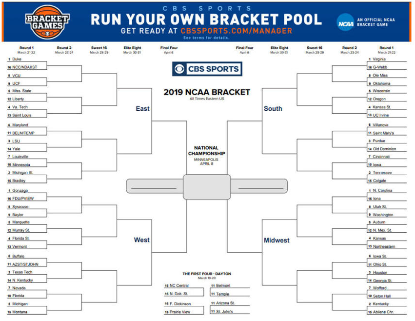
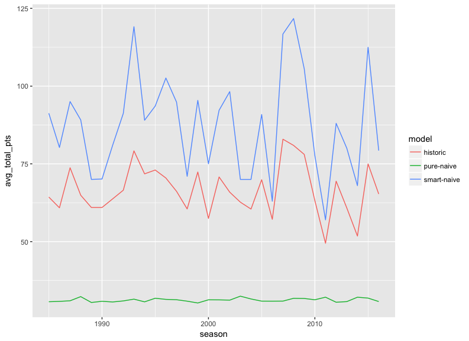
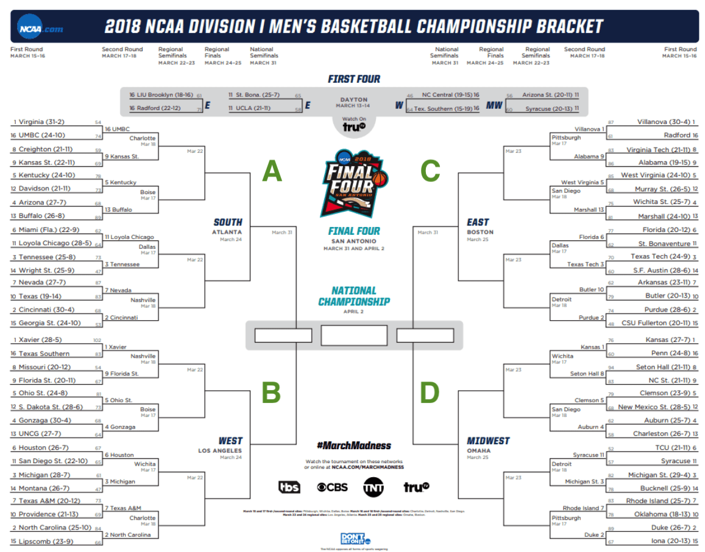

```{r setup, include=FALSE}
knitr::opts_chunk$set(echo = TRUE)
knitr::opts_chunk$set(warnings = FALSE)
knitr::opts_chunk$set(messages = FALSE)
knitr::opts_chunk$set(tidy = TRUE)
knitr::opts_chunk$set(collapse = TRUE)

```

On Monday morning, March 16 you're going to get an email from someone in your office encouranging you to join the March Madness Office Brackets.  You don't follow American College Basketball but want to participate because it goes on for several weeks and gives you something to talk to others about when at the SodaStream.  

#Summary
Every spring American college basketball has a single-elimination tournament spanning several weeks of the 64 best teams to determine the national champion.  

A game has developed from the tournament where a person guesses the winner of each game and is given a certain number of points based on number of wins and which rounds the win occured.  The catch is that the guesser has to submit an entire tournament and cannot wait to see the results of the first round before picking the second round, and so on.  The winner is the person with the most points at the end of the tournament.  

This paper explores three strategies that a person with no knowledge of American college basketball could use to pick winners for their tournament entry.  

* Pure-Naive - Random selection  
* Smart-Naive - Always picking the top ranked team  
* Historic - Use historic brackets to predict future results  

Historic is the novel strategy.  It assumes that the past is an indicator of future performance. Is that a good bet? That's where data science steps in.

*Note:  Naive, in this case, means that the player has no prior knowledge of US Mens College Basketball.  Not to be confused with Naive Bayes.*  

#Overview of Tournament and Game
If someone were playing the March Madness game (aka picking your brackets) this is the traditional printable entry form.  

 

##The Basketball Tournament  
You will notice that it is highly-structured.  
* There are four regions that I've labelled A, B, C, and D.
* Every team in each region is ranked from 1 to 16 based on their perceived strength.  1 being the strongest.  
* The teams in each region play each other in a predetermined order until there is a regional champion.  
* The champions of regions A & B play each other, and the champions of regions C & D play each other in round 5.  
* The winner of that game plays for overall champion in round 6.

##Winning the Brackets  
The key constraint on the bracket player is that you have to pick the winners of all 63 games before the tournament begins.  Those picks are locked down and cannot be changed between rounds.  

The point system that is used in the game is as follows  
* Each correct pick in round 1 is worth 1 point
* Each correct pick in round 2 is worth 2 point
* Each correct pick in round 3 is worth 4 point
* Each correct pick in round 4 is worth 8 point
* Each correct pick in round 5 is worth 16 point
* Each correct pick in round 6 is worth 32 point  

The points in the later rounds become very difficult to get because your entry may predict two winners in round 1 that play each other and you pick incorrectly in round 2.  This shuts off the "points-pipeline" for that branch with no more points possible.  

#How do we know which is best strategy?  
I will simulate each strategy 1000 times with each season from 1985 to present.  We can then compare the results of each strategy across all years and determine which is best.

#Strategy 1  
##Pure Naive  
This is the stereotypical **millenial** in your office that really doesn't want to be there.  
They randomly select winners in each game just to get it over with as quickly as possible.  

This strategy is expected to perform very poorly because it gives equal weight to a 16th ranked team to beat #1 ranked team in the first round.  Until 2018 that had never happened. So 50% of the time they are going to get this pick wrong which loses a lot of points down stream.  

##Spoiler Alert  
The result was that the smart-naive approach had significantly better results against the historic and pure-naive entries.
When 1000 entries were generated with each approach and graphed across all years there is a clear indication that smart-naive is better, and also that the year-on-year results between the two are highly positively correlated.  

* Pure Naive is terrible  
* Historic-based entries as a group never do better than smart-naive in any year, but  
* The two highest individual entry points across all seasons went to Historic entries.  

 


#Source of Data
This data is hosted on [Kaggle](https://www.kaggle.com/c/march-machine-learning-mania-2017/data) .  I use only a subset of all of the data because my approach is not based on the individual colleges but only the rankings that are pre-assigned to them.  

Kaggle has been having an annual competition around this tournament but the purpose of the competition is different than the hypothesis I am testing here. 

##Hypothesis  
* Always picking the highest ranked team does better than a strategy of picking brackets based on how brackets have played out in the past.  
* I have added a pure naive strategy that randomly selects the winner of each game.  This means that a 16 seed has an equal chance of defeating a 1 seed. This should be treated as the baseline score.  


.  


LONG CODE BLOCK, FEEL FREE TO SCROLL THROUGH  


###Summarize Pure-Naive scores  
```{r summarize_pure_naive_results} 
summary(my_pure_naive_results$total_points)
sd(my_pure_naive_results$total_points)
```

###Plot Pure-Naive score distribution  
The vertical line represents the mean.  
```{r plot_pure_naive_results}
model_type <- c("pure-naive", "smart_naive", "historic")
ggplot(my_pure_naive_results, aes(x=total_points, fill = model_type[1], color = model_type[1])) +
  geom_density(aes(alpha = 0.5)) + 
  geom_vline(aes(xintercept = mean(my_pure_naive_results$total_points), 
                 color = model_type[1])) +
  scale_color_brewer(palette = "Set1") + 
  theme(legend.position = "none")
```

A definite right-skew similar to a poisson distribution.  

#Approach 2
##Smart-Naive  
In order to understand this method I want to re-acquaint you with the brackets that the gamer  must fill out in full before the tournament starts.  

  

Remember that the Smart-Naive person has no knowledge of US college basketball but uses the information provided to make selections.  

In this case they notice that in each quadrant someone has gone to the trouble to rank each of the teams in that region 1 to 16.  That person probably knows a lot more about college basketball than they do.  They also understand that the #1 ranked team has the highest perceived strength and #16 has the lowest perceived strength.  

They rationalize that they should always pick the highest ranked team in each game which causes the first four rounds to always play out the same.  
Round 1 winners: #1-8  
Round 2 winners: #1-4  
Round 3 winners: #1-2  
Round 4 winner:  #1  

Since the Smart-Naive person has no additional information to work with in round 5 they randomly select the winner in the region A vs B, and Region C vs D games.  They also randomly select round 6.  

###FUNCTION: create_smart_naive_entries()  
* The first four rounds will ALWAYS have the same picks for each region  
* Rounds 5 & 6 will be randomized because all teams playing will be #1 seeds in their region  
```{r create_smart_naive_entries_function}
create_smart_naive_entries <- function(num_entries = 1) {
  # Every region in rounds 1 - 4 are the same since the smart naive person always
  # selects the lowest seed, because that seed is assumed to have the most strength
  
  # Setup rounds 1 - 4
  sn_round_1 <- c(paste0("A-", 1:8),
                  paste0("B-", 1:8),
                  paste0("C-", 1:8),
                  paste0("D-", 1:8))
  
  sn_round_2 <-  c(paste0("A-", 1:4),
                   paste0("B-", 1:4),
                   paste0("C-", 1:4),
                   paste0("D-", 1:4))
  
  sn_round_3 <-  c(paste0("A-", 1:2),
                   paste0("B-", 1:2),
                   paste0("C-", 1:2),
                   paste0("D-", 1:2))
  
  sn_round_4 <-  c(paste0("A-", 1),
                   paste0("B-", 1),
                   paste0("C-", 1),
                   paste0("D-", 1))
  
  sn_list <- list()
  for (n in 1:num_entries) {
    sn_list[[n]] <- list(
      id = n,
      round_1 = sn_round_1,
      round_2 = sn_round_2,
      round_3 = sn_round_3,
      round_4 = sn_round_4
    )
    # Randomize round 5; since they are both seed #1
    sn_round_5_ab <- sample(c("A-1", "B-1"), 1)
    sn_round_5_cd <- sample(c("C-1", "D-1"), 1)
    
    sn_list[[n]]$round_5 <- c(sn_round_5_ab, sn_round_5_cd)
    
    # Randomize round 6; since they are both seed #1
    sn_list[[n]]$round_6 <-
      sample(c(sn_round_5_ab, sn_round_5_cd), 1)
    
    
  }
  return(sn_list)
}
```

###Make 1000 Smart-Naive entries  
```{r call_create_smart_naive_function, cache=TRUE}
  my_smart_naive_entries <- create_smart_naive_entries(1000)
```

###Score Smart-Naive entries  
```{r score_smart_naive_entries, cache=TRUE}
  my_smart_naive_results <- score_entries(my_smart_naive_entries, reference_season)
```

###Summarize Smart-Naive scores  
```{r summarize_smart_naive_scores}
summary(my_smart_naive_results$total_points)
sd(my_smart_naive_results$total_points)
```
These are pretty incredible results which accurately indicates that a lot of the top seeds won in the later rounds.  This season may be an outlier.  We'll see when I compare across all seasons.  

###Plot Smart-Naive distribution  
Remember that the mean score of Pure-Naive entries was 30.73.  
```{r plot_smart_naive_distribution}
#model_type <- c("pure-naive", "smart_naive", "historic")
ggplot(my_smart_naive_results, aes(x=total_points, fill = model_type[2], color = model_type[2])) +
  geom_density(aes(alpha = 0.5)) + 
  geom_vline(aes(xintercept = mean(my_smart_naive_results$total_points), 
                 color = model_type[2])) +
  scale_color_brewer(palette = "Set1") + 
  theme(legend.position = "none")
```

Interesting that there are five distinct humps.  


###Compare densities of Pure-Naive and Smart Naive  
```{r}
my_pure_naive_results$model <- "pure_naive"
my_smart_naive_results$model <- "smart_naive"
combined_results <- rbind(my_pure_naive_results, my_smart_naive_results)
```

```{r plot_combined_distribution}
ggplot(combined_results, aes(x=total_points, fill = model, color = model)) +
  geom_density(aes(alpha = 0.5)) + 
  geom_vline(aes(xintercept = mean(combined_results$total_points), 
                 color = model)) +
  scale_color_brewer(palette = "Set1") + 
  theme(legend.position = "none")
```

There is a very clear difference between the results of these two models.  Let's create the historic model.

#Approach #3
##Historic  
This approach is based on the theory that past-performance can be used to predict future results.  

*Note: This should not be considered machine learning since there is no mechanism for the algorithm to get better.*  

###FUNCTION: create_historic_entries()  
The function below is very long and the major pieces are:  

###PART 1  
* Get all historic results for rounds 1-4.  
* Break each year into the four individual regions.  
* Strip out the region identifier so that only the rank remains.  
* Add to the overall anonymized results for round 1-4.  
__There should be a total of 128 elements created__  
32 years * 4 regions = 128 final elements 

###PART 2  
* Select 4 random historic brackets and assign to Regions A, B, C, and D.  
* Create a table of how many times each seed has won round 5.  
* Create another table of how many times each seed has won round 6.  
* Use these tables to weight which region and rank to select in rounds 5 & 6.  

LONG CODE BLOCK, FEEL FREE TO SCROLL THROUGH 

```{r create_historic_entries_function}
  create_historic_entries <- function(num_entries = 1) {
    all_results <- get_all_results(return_type = "df", rounds = "1-4")
    
    bracket_list <- list()
    master_list <- list()
    season_list <- list()
    # Create incrementer for master_list
    j <- 1
    for (this_season in unique(all_results$season)) {
      season_results <- all_results %>%
        filter(season == this_season)
      
      for (i in 1:4) {
        if (i == 1) {
          this_region = "A"
        } else if (i == 2) {
          this_region = "B"
        } else if (i == 3) {
          this_region = "C"
        } else if (i == 4) {
          this_region = "D"
        }
        
        region_results <- season_results %>%
          filter(region == this_region)
        
        round_list <- list()
        
        id <- all_results %>%
          filter(season == this_season) %>%
          filter(region == this_region) %>%
          mutate(id = paste0(season, "-", this_region)) %>%
          select(id) %>%
          unique() %>%
          unlist()
        
        round_list[[1]] <- all_results %>%
          filter(season == this_season) %>%
          filter(round == 1) %>%
          filter(region == this_region) %>%
          select(seed) %>%
          arrange(seed)
        
        round_list[[2]] <- all_results %>%
          filter(season == this_season) %>%
          filter(round == 2) %>%
          filter(region == this_region) %>%
          select(seed) %>%
          arrange(seed)
        
        round_list[[3]] <- all_results %>%
          filter(season == this_season) %>%
          filter(round == 3) %>%
          filter(region == this_region) %>%
          select(seed) %>%
          arrange(seed)
        
        round_list[[4]] <- all_results %>%
          filter(season == this_season) %>%
          filter(round == 4) %>%
          filter(region == this_region) %>%
          select(seed) %>%
          arrange(seed)
        
        region_list <- list(
          id = id,
          round_1 = round_list[[1]]$seed,
          round_2 = round_list[[2]]$seed,
          round_3 = round_list[[3]]$seed,
          round_4 = round_list[[4]]$seed
        )
        
        master_list[[j]] <- region_list
        j = j + 1
      }
    }
  
    round_5_6 <- get_all_results(return_type = "df", rounds = "5-6")
    all_seeds <- tibble(seed = 1:16)
    
    round_5_stats <- round_5_6 %>%
      filter(round == 5) %>%
      group_by(seed) %>%
      summarize(number = n()) %>%
      right_join(all_seeds, by = "seed") %>%
      replace_na(list(number = 0))
    
    round_6_stats <- round_5_6 %>%
      filter(round == 6) %>%
      group_by(seed) %>%
      summarize(number = n()) %>%
      right_join(all_seeds, by = "seed") %>%
      replace_na(list(number = 0))
    
    
    #==============================
    # ROUNDS 1-4
    #==============================
    entry_list <- list()
    for (j in 1:num_entries) {
      regional_bracket_list <- list()
      # Get four historic brackets by sampling the master list
      regional_bracket_list <-
        sample(master_list, 4, replace = TRUE)
      
      # For each element we need to append the region code: A, B, C, or D
      
      for (i in 1:4) {
        if (i == 1) {
          this_region = "A"
        } else if (i == 2) {
          this_region = "B"
        } else if (i == 3) {
          this_region = "C"
        } else if (i == 4) {
          this_region = "D"
        }
        
        regional_bracket_list[[i]]$round_1 <- paste0(this_region,
                                                     "-",
                                                     regional_bracket_list[[i]]$round_1)
        regional_bracket_list[[i]]$round_2 <- paste0(this_region,
                                                     "-",
                                                     regional_bracket_list[[i]]$round_2)
        regional_bracket_list[[i]]$round_3 <- paste0(this_region,
                                                     "-",
                                                     regional_bracket_list[[i]]$round_3)
        regional_bracket_list[[i]]$round_4 <- paste0(this_region,
                                                     "-",
                                                     regional_bracket_list[[i]]$round_4)
        
      }
      
      # Condense to a single list for the final entry
      entry_num <- j
      this_round_1 <- regional_bracket_list %>%
        map("round_1") %>%
        unlist()
      this_round_2 <- regional_bracket_list %>%
        map("round_2") %>%
        unlist()
      this_round_3 <- regional_bracket_list %>%
        map("round_3") %>%
        unlist()
      this_round_4 <- regional_bracket_list %>%
        map("round_4") %>%
        unlist()
      
      final_entry <- list(
        id = entry_num,
        round_1 = this_round_1,
        round_2 = this_round_2,
        round_3 = this_round_3,
        round_4 = this_round_4
      )
      
      #===============================
      # ROUND 5
      #===============================
      a_winner <- unlist(regional_bracket_list[[1]][5])
      b_winner <- unlist(regional_bracket_list[[2]][5])
      c_winner <- unlist(regional_bracket_list[[3]][5])
      d_winner <- unlist(regional_bracket_list[[4]][5])
      
      a_df <- tibble(
        ref_bracket = unlist(regional_bracket_list[[1]][1]),
        winner = unlist(regional_bracket_list[[1]][5]),
        seed = as.integer(str_replace(winner, "^[ABCD]-", "")),
        region = str_extract(winner, "^[ABCD]")
      )
      
      b_df <- tibble(
        ref_bracket = unlist(regional_bracket_list[[2]][1]),
        winner = unlist(regional_bracket_list[[2]][5]),
        seed = as.integer(str_replace(winner, "^[ABCD]-", "")),
        region = str_extract(winner, "^[ABCD]")
      )
      c_df <- tibble(
        ref_bracket = unlist(regional_bracket_list[[3]][1]),
        winner = unlist(regional_bracket_list[[3]][5]),
        seed = as.integer(str_replace(winner, "^[ABCD]-", "")),
        region = str_extract(winner, "^[ABCD]")
      )
      d_df <- tibble(
        ref_bracket = unlist(regional_bracket_list[[4]][1]),
        winner = unlist(regional_bracket_list[[4]][5]),
        seed = as.integer(str_replace(winner, "^[ABCD]-", "")),
        region = str_extract(winner, "^[ABCD]")
      )
      
      ab_round_5 <- rbind(a_df, b_df)
      
      # Does A win; this is binary so if A doesn't win then B wins
      # join in round 5 stats
      ab_final <- ab_round_5 %>%
        left_join(round_5_stats, by = "seed")
      
      if (ab_final$number[1] == ab_final$number[2]) {
        ab_winner <- sample(c(ab_final$winner[1], ab_final$winner[2]), 1)
      } else if (ab_final$number[1] == 0) {
        ab_winner <- ab_final$winner[2]
      } else if (ab_final$number[2] == 0) {
        ab_winner <- ab_final$winner[2]
      } else {
        a_num <- ab_final$number[1]
        b_num <- ab_final$number[2]
        
        a_pct <- a_num / (a_num + b_num)
        if (runif(1) <= a_pct) {
          ab_winner <- ab_final$winner[1]
        } else {
          ab_winner <- ab_final$winner[2]
        }
      }
      
      ab_winner_record <- ab_final %>%
        filter(winner == ab_winner) %>%
        select(-number)
      
      # Do the same for C & D
      cd_round_5 <- rbind(c_df, d_df)
      
      cd_final <- cd_round_5 %>%
        left_join(round_5_stats, by = "seed")
      
      if (cd_final$number[1] == cd_final$number[2]) {
        cd_winner <- sample(c(cd_final$winner[1], cd_final$winner[2]), 1)
      } else if (cd_final$number[1] == 0) {
        cd_winner <- cd_final$winner[2]
      } else if (cd_final$number[2] == 0) {
        cd_winner <- cd_final$winner[2]
      } else {
        c_num <- cd_final$number[1]
        d_num <- cd_final$number[2]
        
        c_pct <- c_num / (c_num + d_num)
        if (runif(1) <= c_pct) {
          cd_winner <- cd_final$winner[1]
        } else {
          cd_winner <- cd_final$winner[2]
        }
      }
      cd_winner_record <- cd_final %>%
        filter(winner == cd_winner) %>%
        select(-number)
      
      # Append round 5 winners to final entry
      final_entry$round_5 <- c(ab_winner_record$winner,
                               cd_winner_record$winner)
      
      #==================================
      # ROUND 6
      #==================================
      abcd_final <- rbind(ab_winner_record, cd_winner_record) %>%
        left_join(round_6_stats, by = "seed")
      
      # Check for special conditions
      if (abcd_final$number[1] == abcd_final$number[2]) {
        abcd_winner <-
          sample(c(abcd_final$winner[1], abcd_final$winner[2]), 1)
      } else if (abcd_final$number[1] == 0) {
        abcd_winner <- abcd_final$winner[2]
      } else if (abcd_final$number[2] == 0) {
        abcd_winner <- abcd_final$winner[1]
      } else {
        ab_num <- abcd_final$number[1]
        cd_num <- abcd_final$number[2]
        
        ab_pct <- ab_num / (ab_num + cd_num)
        if (runif(1) <= ab_pct) {
          abcd_winner <- abcd_final$winner[1]
        } else {
          abcd_winner <- abcd_final$winner[2]
        }
      }
      
      abcd_winner_record <- abcd_final %>%
        filter(winner == abcd_winner) %>%
        select(-number)
      
      # Append round 6 winner to final_entry
      final_entry$round_6 <- abcd_winner_record$winner
      
      entry_list[[j]] <- final_entry
    }
    return(entry_list)
  }
```

###Make 1000 Historic entries  
```{r call_create_historic_entries_function, cache=TRUE}
  my_historic_entries <- create_historic_entries(1000)
```

###Score Historic entries  
```{r score_historic_entries, cache=TRUE}
  my_historic_results <- score_entries(my_historic_entries, reference_season)
```

###Summarize Historic scores  
```{r summarize_historic_entry_scores}
summary(my_historic_results$total_points)
sd(my_historic_results$total_points)
```

WOW!!  A max of 168 out of 192 total points possible.  That is a very high score.  

###Plot Historic score distribution  
```{r plot_historic_entry_distribution}
model_type <- c("pure-naive", "smart_naive", "historic")
ggplot(my_historic_results, aes(x=total_points, fill = model_type[3], color = model_type[3])) +
  geom_density(aes(alpha = 0.5)) + 
  geom_vline(aes(xintercept = mean(my_historic_results$total_points), 
                 color = model_type[3])) +
  scale_color_brewer(palette = "Set1") + 
  theme(legend.position = "none")
```

Right skewed with the mean of 83.076.  

###Are smart_naive and historic statistically significant?  
```{r perform_t_test_1}
t.test(my_smart_naive_results$total_points, my_historic_results$total_points)
```

__Yes, the difference is significant. The p-value is well below 0.05 so for this year the Smart-Naive approach is significantly better than the Historic approach.__  

###Show all three model distributions?  

```{r}
my_historic_results$model <- "historic"
combined_results <- bind_rows(combined_results, my_historic_results)

ggplot(combined_results, aes(x=total_points, fill = model, color = model)) +
  geom_density(aes(alpha = 0.5)) + 
  geom_vline(aes(xintercept = mean(combined_results$total_points), 
                 color = model)) +
  scale_color_brewer(palette = "Set1") 
  #theme(legend.position = "none")
```

#Score each model across all years  
The data includes the results since 1985 which gives us 32 years to test against to see if there really is a significant difference on-average between the two methods.  


###FUNCTION: create_reference_season_list() 
This function gathers all of the historical results into a single list.  
```{r create_reference_season_list_function}
# Create function to build list of the results of every season
create_reference_season_list <- function() {
reference_season_list <- list()
#start_time <- Sys.time()
j <- 1
for(i in 1985:2016) {
  #print(paste("Building", i,  "season ..."))
  
  reference_season_list[[j]] <- get_tourny_results(my_season = i)
  #print(paste("Season", i , "complete"))
  j <- j + 1
}
#end_time <- Sys.time() 
#print(end_time - start_time)

return(reference_season_list)
}
```

###Get list of actual tournament results for all Seasons  
```{r get_tourny_results_list, cache=TRUE}
reference_season_list <- create_reference_season_list()
```

###Format of Reference Season list  
```{r display_reference_season_format_2}
reference_season_list[[1]]
```

###FUNCTION: score_entry_lists()  

```{r score_entry_lists_function, cache=TRUE}
score_entry_lists <- function(my_entries) {
  #start_time <- Sys.time()
  #print(paste("Start time is:", start_time))
  all_seasons_score_list <- list()
  j <- 1
  for (i in seq_along(reference_season_list)) {
    all_scores_list <- list()
    this_season <- reference_season_list[[i]]$id
    #start_time <- Sys.time()
    #print(paste("Pure-naive for", this_season, "started ..."))
    my_pure_naive_scores <-
      score_entries(my_entries[[1]], reference_season_list[[i]])
    #end_time <- Sys.time()
    #print("COMPLETE")
    #print(end_time - start_time)
    
    #start_time <- Sys.time()
    #print(paste("Smart-naive for", this_season, "started ..."))
    my_smart_naive_scores <-
      score_entries(my_entries[[2]], reference_season_list[[i]])
    # end_time <- Sys.time()
    # print("COMPLETE")
    # print(end_time - start_time)
    # 
    # start_time <- Sys.time()
    # print(paste("Historic for", this_season, "started ..."))
    my_historic_scores <-
      score_entries(my_entries[[3]], reference_season_list[[i]])
    # end_time <- Sys.time()
    # print("COMPLETE")
    # print(end_time - start_time)
    
    all_scores_list <- list(
      pure_naive = my_pure_naive_scores,
      smart_naive = my_smart_naive_scores,
      historic_entries = my_historic_scores
    )
    
    all_scores_list[[1]]$season <- this_season
    all_scores_list[[2]]$season <- this_season
    all_scores_list[[3]]$season <- this_season
    
    all_scores_list[[1]]$model <- "pure-naive"
    all_scores_list[[2]]$model <- "smart-naive"
    all_scores_list[[3]]$model <- "historic"
    
    all_seasons_score_list[[j]] <- all_scores_list
    j <- j + 1
  }
  all_seasons_score_final_list <- do.call(rbind, all_seasons_score_list)
  all_seasons_score_final_df <- do.call(rbind, all_seasons_score_final_list)
  
  #end_time <- Sys.time() 
  #print(end_time - start_time)
  
  return(all_seasons_score_final_df)
}
``` 

###Score all entries across all seasons  
__This function takes a long time to run__  
I will load a saved version of the output because the results won't cache.  
```{r score_all_entries_all_years, eval=FALSE}
scored_entries <- score_entry_lists(all_entries)
```

```{r read_preprocessed_scored_entries, cache=TRUE}
scored_entries <- readRDS(paste0(data_dir, "/scored_entries_v3.RDS"))
```

###FUNCTION: summarize_scores()  
This function summarizes the output of the `score_entry_lists()` function.  
```{r summarize_scores}
summarize_scores <- function(my_scores) {
  summarized_scores <- my_scores %>%
    group_by(season, model) %>%
    summarize(
      avg_total_pts = mean(total_points),
      avg_round_1 = mean(rnd_1_pts),
      avg_round_2 = mean(rnd_2_pts),
      avg_round_3 = mean(rnd_3_pts),
      avg_round_4 = mean(rnd_4_pts),
      avg_round_5 = mean(rnd_5_pts),
      avg_round_6 = mean(rnd_6_pts)
    ) %>%
    ungroup()
  
  return(summarized_scores)
}
```

###Get summarized scores   
```{r get_summarized_scores}
my_summarized_scores <- summarize_scores(scored_entries)
sample_n(my_summarized_scores, 10)
```

###Display score summary by model  
```{r display_summarized_scores}
my_summarized_scores %>% 
  group_by(model) %>%
  summarize(model_avg = mean(avg_total_pts), model_sd = sd(avg_total_pts)) %>%
  arrange(-model_avg)
```

###Test if the difference between Smart-Naive and Historic is statistically significant  

```{r t_test_2}
smart_naive <- my_summarized_scores %>%
  filter(model == "smart-naive")

historic <- my_summarized_scores %>%
  filter(model == "historic")

t.test(smart_naive$avg_total_pts, historic$avg_total_pts)
```

__Yes, the difference is significant. The p-value again is far below 0.05 so we know that smart-naive is significantly better than historic year-on-year.__  

###Density plot of all three models  
```{r plot_density_all_models}
ggplot(scored_entries, aes(x=total_points, fill = model, color = model)) +
  geom_density(aes(alpha = 0.5)) + 
  scale_color_brewer(palette = "Set1") 
```

This chart clearly shows the performance of each model.  Each model is significantly different than the others.  

##Top 10 entries
```{r display_top_10}
scored_entries %>%
  arrange(-total_points) %>%
  select(season, model, entry_num, total_points) %>%
  head(10)
```
The top 2 are Historic and the rest are Smart-Naive from 2008.  The rankers of the teams must have gotten it right in 2008.  

There appears to be more upside potential with the Historic selections but on average Historic performs significantly worse than Smart-Naive.  

#How did they do in 2018?  

The 2018 tournament just concluded and the winner was a #1 seeded team so smart_naive may have an advantage. 

The 2018 tournament had a couple of unusual events that may make it nearly impossible to have a perfect bracket.  
* In Region A the #1 ranked team lost to the #16 ranked team in the first round.  That has never happened before.  
*  Also in Region A, the #11 ranked team won the region.  That has only happened three times in the 32 years, and 128 brackets in the data since 1985.  

Let's see if smart-naive would win again in 2018.  

###Create 2018 Reference Season in correct format  
```{r create_2018_reference_season}
round_1 <- c("A-16", "A-9", "A-5", "A-13", "A-11", "A-3", "A-7", "A-2", 
             "B-1", "B-9", "B-5", "B-4", "B-6", "B-3", "B-7", "B-2", 
             "C-1", "C-9", "C-5", "C-13", "C-6", "C-3", "C-10", "C-2", 
             "D-1", "D-8", "D-5", "D-4", "D-11", "D-3", "D-7", "D-2")

round_2 <- c("A-9", "A-5", "A-11", "A-7", 
             "B-9", "B-4", "B-3", "B-7", 
             "C-1", "C-5", "C-3", "C-2", 
             "D-1", "D-5", "D-11", "D-2")

round_3 <- c("A-9", "A-11", 
             "B-9", "B-3", 
             "C-1", "C-3", 
             "D-1", "D-2")

round_4 <- c("A-11",
             "B-3", 
             "C-1", 
             "D-1")

round_5 <- c("B-3", "C-1")
round_6 <- "C-1"

reference_year <- list(id = 2018, 
                       round_1 = round_1, 
                       round_2 = round_2, 
                       round_3 = round_3, 
                       round_4 = round_4, 
                       round_5 = round_5,
                       round_6 = round_6)

```

###Score all entries against 2018 results  
```{r score_2018_entries, cache=TRUE} 
results_2018_pure_naive <- score_entries(my_pure_naive_entries, reference_season) %>%
  mutate(model = "pure-naive")
results_2018_smart_naive <- score_entries(my_smart_naive_entries, reference_season) %>%
  mutate(model = "smart-naive")
results_2018_historic <- score_entries(my_historic_entries, reference_season) %>%
  mutate(model = "historic")
```

###Bind all results into single dataframe  
```{r bind_results}
all_2018_results <- bind_rows(results_2018_pure_naive, 
                              results_2018_smart_naive, 
                              results_2018_historic)
```

###Group by model and summarize  
```{r display_2018_summary}
all_2018_results %>% 
  group_by(model) %>%
  summarize(model_avg = mean(total_points), model_sd = sd(total_points)) %>%
  arrange(-model_avg)
```
Again, smart_naive won by a large margin.  

###Test for significance
```{r t_test_3}
smart_naive <- all_2018_results %>%
  filter(model == "smart-naive")

historic <- all_2018_results %>%
  filter(model == "historic")

t.test(smart_naive$total_points, historic$total_points)
```
__Yes, the difference is significant. The p-value again is far below 0.05 so we know that smart-naive is significantly better than historic for 2018.__   

###Did Historic get the overall high score in 2018?  
It is clearly shown in the distribution cart below that smart_naive and historic  
```{r display_top_10_2}
all_2018_results %>%
  select(model, entry_num, total_points) %>%
  arrange(-total_points) %>%
  top_n(10)
```
Yes, Historic got the top entries again in 2018 also.

###Plot 2018 model results  
```{r plot_2018_model_results}
ggplot(all_2018_results, aes(x=total_points, fill = model, color = model)) +
  geom_density(aes(alpha = 0.5)) + 
  scale_color_brewer(palette = "Set1") 
```


#Conclusion
Next year when someone puts a tournament sheet in front of you, just pick all of the highest ranked teams and you'll save a lot of time and may even finish in 1st place, tied with everyone else that uses the Smart-Naive strategy.  

##END
